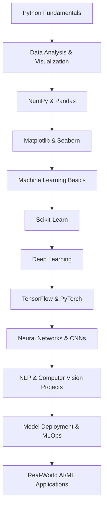

# Hi 👋, I'm Saurabh Kushwaha

# Full Stack Developer | Transitioning into AI & Machine Learning

### 🔥 About Me

* 💻 I’m a **Full Stack Developer** with **3+ years of experience** specializing in **Angular, Next.js, React, React Native, Node.js, and MongoDB**.
* 🌱 Currently exploring **Artificial Intelligence and Machine Learning** to build intelligent applications.
* 🚀 Passionate about solving real-world problems with technology and continuously expanding my skill set.

### 🔧 Tech Stack

#### 🌐 Frontend:

#### 🛠 Backend:

#### 📱 Mobile & Hybrid Apps:

#### 🤖 AI / ML (Learning Journey):

#### ☁ DevOps / Tools:

### 📌 Major Projects (Generic / Impactful)

| Project Name                           | Description                                                                                                                         | Tech Used                             |
| -------------------------------------- | ----------------------------------------------------------------------------------------------------------------------------------- | ------------------------------------- |
| **Water Service Platform**             | Real-time service request & technician management system. Live tracking and admin dashboards.                                       | Next.js, Node.js, MongoDB             |
| **NGO Donation & Admin Dashboard**     | Donation platform with secure payment processing and real-time campaign dashboards.                                                 | Angular, Node.js, Razorpay, AWS       |
| **E-commerce & Service Ecosystem**     | Multi-role platform for customers, vendors, and service engineers. Features: product listing, wallet, payments, service allocation. | Angular, React Native, Ionic, Node.js |
| **Healthcare Directory App**           | Platform for exploring and booking healthcare services with real-time feeds.                                                        | Ionic                                 |
| **Consumer-Focused Web & Mobile Apps** | Apps for shopping, discount deals, social media modules with modern UX.                                                             | React.js, Flutter, Angular, Node.js   |
| **Vehicle Data Management System**     | Dynamic search and filter system for large vehicle datasets.                                                                        | Angular, Node.js                      |

> 🔜 More AI/ML projects coming soon as part of my learning journey.

### 📊 GitHub Stats

  
  

### 🎯 Current Focus

* 🔭 Enhancing AI/ML skills (Neural Networks, Computer Vision, NLP)
* 📚 Building real-world AI applications
* 🎓 Strengthening problem-solving & system design skills

### 🛠️ AI/ML Learning Roadmap

**Milestones:**

1. Learn Python for AI/ML & Data Analysis
2. Master NumPy, Pandas, Matplotlib, Seaborn
3. Implement ML algorithms with Scikit-Learn
4. Explore Deep Learning frameworks (TensorFlow, PyTorch)
5. Build Neural Networks, CNNs, and NLP models
6. Deploy AI models and learn MLOps practices
7. Apply AI/ML to real-world full-stack projects

### 🤝 Connect With Me

### ✨ Future Vision

> I am currently moving toward **AI/ML to integrate intelligence into full-stack products** and build next-gen applications that solve real-world problems efficiently.
